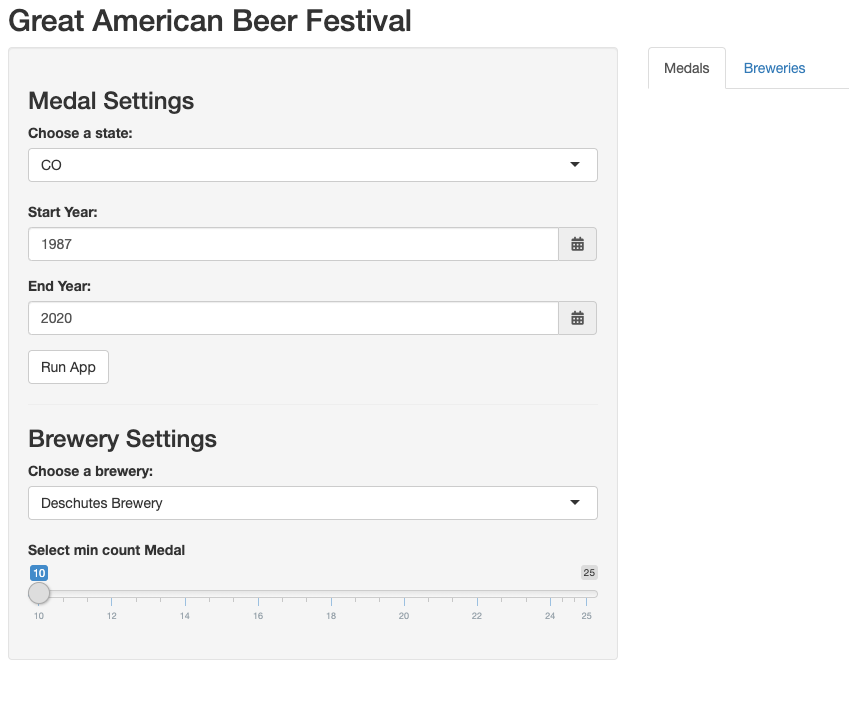
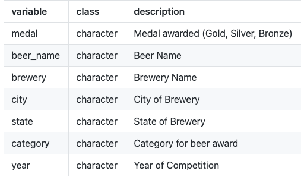
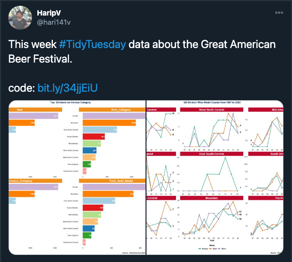
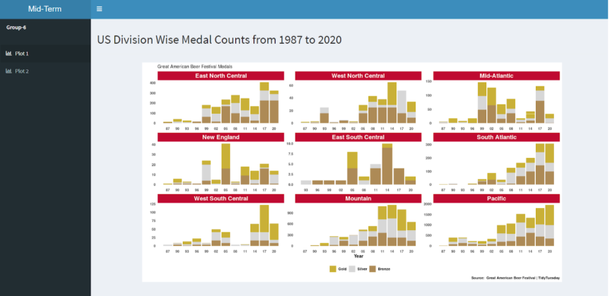
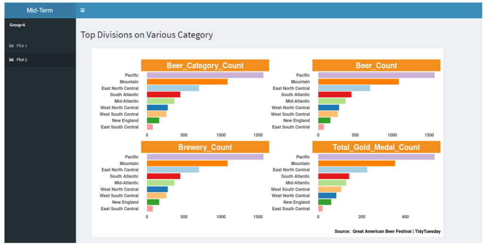

```{r setup, include=FALSE}
knitr::opts_chunk$set(echo = TRUE)
```

## 1. Introduction
|       In this project, our domain problem is to produce an interactive shiny app for the Great American Festival Beer Awards for our target audience on a high-level. This data set has seven attributes such as: medal, beer_name, brewery, city, state, category and year. On a lower-level domain, this tool should enable the user to be able to interact with the app by providing queries/inputs that output a visualization on the information requested on the beer awards data. 
|       We want the user to be able to find out the type of medal awards received in the Great American Beer Festival awards over the years. We also wanted to visualize the breweries in each state and the number of medals received in each brewery. During our data exploration we found that there were some brewery names that had extra fuzzy characters which was basically creating a unique brewery name. We wanted our app to highlight and show appropriate brewery rankings.

## 2. Data Preparation
|       We prepared our data set by normalizing all the state names and abbreviations by mutation in order to be uniform. For example, we re-coded “Ak” to “AK”.  To get into our analysis for visualization, we created a new variable “states” that had inputs for the unique beer awards by state. Similarly, we created variable “brewery”, to produce unique set of breweries in data set. We didn't have to do too many preparation steps to get the medal details but we had some additional data preparation steps for our brewery visualization.

`beer_awards <- beer_awards %>% mutate(state = recode(state, "wa" = "WA","Ak" = "AK"))`
`states <- distinct(beer_awards, state)`
`medal_colors = c("#965A38","#DFBC00","#BFC1C2")`
`brewery<-distinct(beer_awards, brewery)`

|       We transformed the brewery names to first remove any duplicates that had extra/fuzzy characters. We created a data frame for decision making removing the duplicates. We then removed breweries that have similar names but in different cities. We made a dictionary with replacements, if the brewery names are not unique. We then did some additional data preparation steps in order to create two sets, one before the duplicates are fixed and one after. We are using this data to create the visualizations provided in the breweries tab.

## 3. Encoding/Interaction Design

|       For this Shiny application, our team made many design & encoding decisions. In this particular app, we had 5 inputs: State, Start Year, End Year, Brewery name and Minimum Medals. We are using these four inputs to vary the output that the user sees. For the medals tab, we want the user to be able to control the state, start year, and end year so that we can provide a visualization of that particular state's medal count over the years. We wanted the plot to be interactive so that the user can hover over various sections and get the details and we used Plotly in order to achieve that. We also wanted to avoid the use to red and green hues in our chart so we used the Gold/Silver/Bronze coloring and this also added to the overall coherence of the visualization.



|       For the brewery tab, we have the brewery name and minimum medals as the customer input. Our vision for this visualization was to identify potential data errors when it comes to brewery names that could have caused the medal counts to be inaccurate. Once the user runs the app, the app loads the top 30 breweries by Medal count. In this visualization, we wanted to show the ranking of the breweries before and after the duplicates were removed. We also decided to add in a visualization that shows the introduction of the duplicate name so that the user is really able to see the fuzzy word. We added in the minimum medals input slider so that the user is able to limit how many breweries are shown in the visualization and can filter out any breweries without the minium number of medals designated by the input slider.


## 4. Algorithm Design
|       For our algorithm design, our main focus was to have various inputs that were both reactive and made updates on the fly. For our first visualization, we wanted to get the medals won by a particular state over a customer range of years. The biggest challenge faced from an algorithm perspective was getting a date picker that is only limited to years. In order to work through this issue, we found some date picker html widget which had controls for the levels of dates we the user can pick. With this in place and some text parsing, we were able to pass just the year value to the reactive function which gets called on button click. This operation works very quickly and is able to output the data to both tabs (Medals & Brewery) without taking too much time to process. 
|     For our second visualization, we wanted to see the changes made by the user much more dynamically. Our goal was to use the run button to generate the necessary data and then have some additional inputs the user can edit in order to see the visualization update. We chose to have two inputs brewery & minimum medals which both update dynamically without having to hit the Run button again. We wanted to limit the amount of processing the application is doing by staging all the necessary details when the Run button is clicked and then make dynamic updates to the UI without having any slow/sluggish reaction time. I wouldn't say that our algorithm is perfect because there are many null checks and empty strings that we did not implement due to lack of time but those code chunks are only for edge/error cases and the user, if the select the inputs, will not run into this 


## 5. User Evaluation
|       Our shiny app is designed to serve particular needs of predetermined user group. The application is targeted for mainly brewing company analysts and researchers.Therefore, it is particularly significant to carry out user evaluation test to understand how this app affects their users, under what conditions, it satisfies the users’ needs,if it responds to their expectations and if users can effectively draw some benefit from the activity. Thus, we address 4 different criteria to conduct our evaluation process.

### Functionality:
In terms of functionality, we met the desired expectation of users. To articulate in detail, we designed our app to meet main two types of functional tests. Server function tests and Snapshot-based tests.

- Server function tests: each function was tested by providing appropriate input, verifying the output and comparing the actual results with the expected results.
- Snapshot based tests: we manually performed user actions, such as clicking on buttons and setting inputs to particular values.

### Effectiveness:
Even if we critically look at the app design and information delivery process, we could say in the worst case we met our users’ needs. We on purpose made a great effort to use mainly interactive visualization tools to have better functionality.Therefore, we intended to make our app significantly user-friendly and we think we wereable to achieve that as the app is intuitive and straightforward to use.

### Efficiency:
We could say that using bigger data would definitely hinder the efficiency of the app. However, we used relatively smaller data and implemented several interactive charts and some with less heavy calculations so that the users can accomplish their desired tasks very quickly and efficiently.

### Usefulness:
Users would definitely will have opportunity to easily leverage the beer festival platform for their analytics to answer their most important business questions such as: Which states have the most medal counts? How do they stack up against the competitors? By creating a fuzzy duplicate section we are able to provide more insight to the user of the app about potential data issues.

## 6. Future Work
Through this project, we accomplished our main intended goals. However, there are a few more improvements can be done to improve the functionality and effectiveness of the app. Due to limited personal skill set and project delivery time frame, we could not leverage all our expectation in building the app. In the future, we would like to embed HTML tools to our app to create a homepage to improve the UI of the app. Moreover, our app is mostly in static mode. We would like to make it more dynamic where user can right away pull the data from database and bring it to our app and perform the analysis with the click of a button. Other than that, most of our charts are interactive, but not all the parts of it is reactive. Hence, we would like to embed more reactivity to our app. Overall, we could say that we learned more things that did not work than did work, which we think is
also a big learning curve for us.


## 7. Apendix
We started work on this Great American Beer Festival from our Midterm Project. This data was part of the tidy tuesday datasets and we had a lot of fun exploring the different types of visualizations we can create.

- [Data set link](https://github.com/rfordatascience/tidytuesday/blob/master/data/2020/2020-10-20/readme.md)
- [Shiny App link](https://jreji.shinyapps.io/FinalProject/)

Here is the details from the data:



Below is the original [twitter post](https://twitter.com/hari141v/status/1319179371131760641):



For our Midterm, we built out a [FlexDashboard](https://azick-uncc.shinyapps.io/Group1/) where we re-vamped the original author's visualizations:




